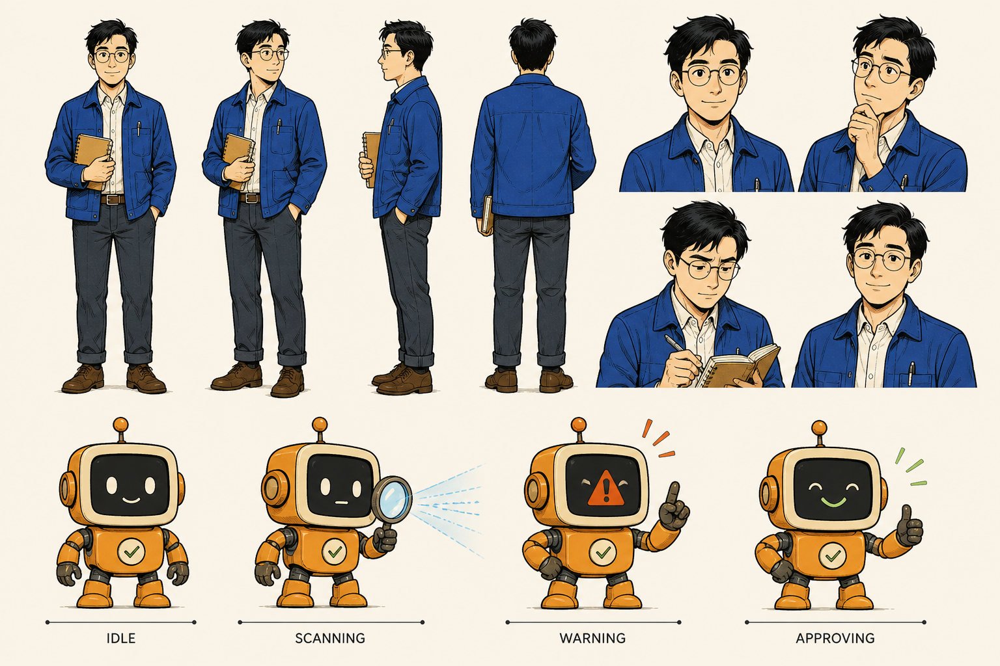

# 从长文章到可验证三视图：一条可追踪的内容生产线

> 用同一份事实账本连接完整阅读、一页纸与编辑型漫画

## 一分钟速览

可靠的内容转换不是把长文压短，而是让完整原文、视觉摘要和漫画各司其职，并在交付前共同通过内容、安全与事实覆盖检查。

- 阅读视图保留完整结构，一页纸负责扫描，漫画负责叙事
- 采集、规范化、事实映射和输出验证组成可追踪流程
- 任何不完整、不安全或验证失败的结果都不能静默交付

## 为什么摘要不能冒充原文

阅读、摘要和漫画承担不同任务：阅读视图要完整保留原文结构与上下文，一页纸帮助快速扫描重点，漫画则用场景和角色重组理解路径。摘要不能替代原文，漫画也不能成为新的事实来源。

三个视图必须共享同一份事实账本。这样，读者既能快速理解，也能回到完整内容核对每一个重要结论。

## 同一份事实如何流向三个视图

1. 采集：先保存标题、段落、列表、表格、代码和媒体链接的来源快照。
2. 规范化：移除导航等页面噪声，但不改写被保留内容的含义与顺序。
3. 映射事实：把八条事实逐一连接到一页纸模块和漫画分镜。
4. 验证输出：重新计算内容完整度、事实覆盖率、资产安全和离线文件一致性。

构建器只接受版本化数据包，不接受远程 HTML 字符串；远程页面必须先转换为经过检查的结构化快照。

*角色参考图用于保持两页漫画中的人物与配色连续。*

图片必须保存为安全的本地资产，并记录生成方式、文件哈希、格式、尺寸和字节数，成品页面不依赖远程图片。

## 发布前的六项检查

*交付门禁*

| 检查项 | 通过条件 |
| --- | --- |
| 文本 | 来源文字完整保留，缺失项为零 |
| 章节 | 标题和顺序与来源快照一致 |
| 表格 | 表头、行列和单元格内容完整 |
| 代码 | 代码块按原样进入阅读视图 |
| 媒体链接 | 保留为安全链接，不加载远程可执行内容 |
| 事实覆盖 | 一页纸和漫画均覆盖全部事实 |

完整展开模式要求一页纸与漫画对事实账本达到百分之百覆盖；任何事实缺口都会让验证失败。

## 失败也必须可解释

如果提取不完整，系统必须指出缺失的章节或内容块；如果媒体不安全，系统必须阻止它进入成品并说明原因。

如果图片生成不可用、不安全或在有限重试后仍失败，必须显式切换为整套编辑型漫画回退，不能混用两种漫画交付模式。

如果最终验证未通过，构建流程必须拒绝交付，并保留可定位的错误信息供下一轮修正。

来源：项目原创演示文章
